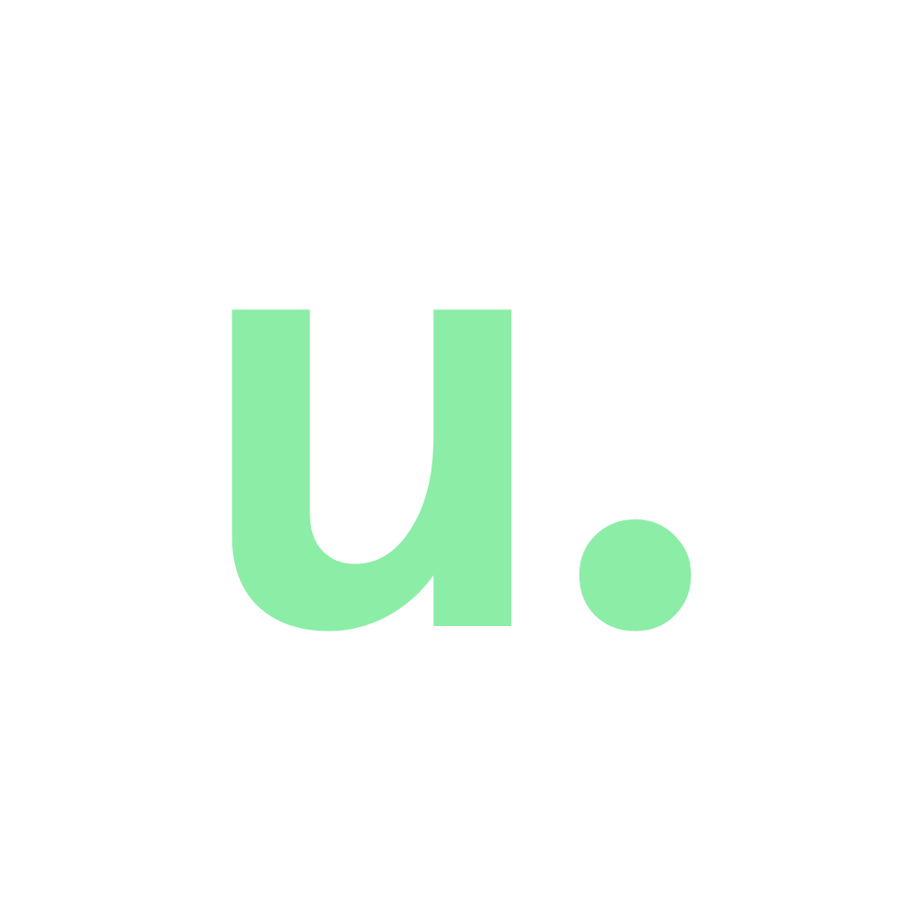

<h1 align="center">Hi 👋, I'm Aaron </h1>

<h2 align="left">About me🌿:</h2>

Hi! I'm Aaron, a 4th year Computer Science student at UC San Diego with a minor in Design (UI/UX). When I'm not coding, you can find me chugging Poppi prebiotic soda, bouldering, watching anime, and playing the piano.

 

<h2 align="left">Languages and Tools🪛:</h3>

 
<h2 align="left">Work Experience⚙️:</h2>

**Software Engineer Intern** \
[**ServiceNow**](https://www.servicenow.com/) • Internship \
Implemented Generative AI solutions on the Financial Services Operations team \
 

**Software Developer Research Intern** \
[**UCSD Design Lab**](https://designlab.ucsd.edu/) • Internship \
Languages & Technologies: `Typescript`, `React`, `Langchain`, `OpenAI API`, `Flask`, `Python`, `Firebase` \
 

**Frontend Developer Intern** \
[**Center for Applied Internet Data Analysis**](https://www.caida.org/) • Internship \
Languages & Technologies: `React`, `GraphQL`, `HTML`, `SASS`, `Javascript`, `PHP` \
 

**Data Science Instructor Aide** \
[**Hack the Hood**](https://www.hackthehood.org/) • Part-Time \
Languages & Technologies: `Python`, `SQL`, `NumPy`, `Pandas`, `Matplotlib`, `Seaborn`, `Scikit`, `Github` \
 

**Software Developer Intern** \
[**IBM Accelerate**](https://www.ibm.com/employment/accelerate/) • Fellowship \
Languages & Technologies: `Javascript`, `React`, `Express`, `Material UI`, `React Testing`, `Github`\
 

**Software Developer Intern** \
[**Cognixion**](https://www.cognixion.com/) • Internship \
Languages & Technologies: `Python`, `Flask`, `HTML`, `CSS`, `Javascript`, `Bootstrap` \
 

**Software Developer Intern** \
[**Alan AI**](https://alan.app//) • Internship \
Languages & Technologies: `Flutter`, `Dart`, `Javascript`, `Firebase`\
 

<h2 align="left">Clubs✨:</h2>

**Web Developer** \
[**UCSD Design Co**](https://ucsddesign.co/) • Club \
Languages & Technologies: `React`, `Javascript`, `Sass`, `Responsive Web Design`\
 

**Software Developer** \
[**Triton Software Engineering**](https://tse.ucsd.edu/) • Club \
Languages & Technologies: `Flutter`, `Dart`, `Firebase`, `Responsive Design`\
 

<h2 align="left">Personal Projects🧇:</h2>

**Frontend Developer** \
[**Portfolio**](https://www.aaron-chan.dev/) • Personal Project \
Languages & Technologies: `Astro`, `React`, `HTML`, `CSS`, `Javascript`, `React Three Fiber (ThreeJS)`\
 

**Fullstack Web Developer** \
[**Unitivity**](https://www.aaron-chan.dev/unitivity) • Personal Project \
Languages & Technologies: `React`, `Nextjs`, `Sass`, `PostgreSQL`, `Prisma`, `Amazon S3`, `Github`\
 

